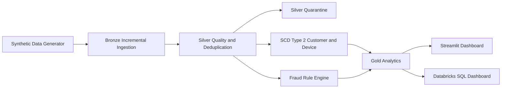

# UPI Sentinel Lakehouse


UPI Sentinel Lakehouse is a portfolio-grade Data Engineering project for incremental fraud and mule-account detection.

**Synthetic Data only:** every CSV, fallback record, dashboard metric, and Delta output in this repository is synthetic UPI-like telemetry. This is not real banking data, customer data, or production payment traffic.

## Business Problem

Payment fraud analytics needs more than a single query. The project demonstrates how a lakehouse can ingest events incrementally, quarantine bad records, preserve customer/device history with SCD Type 2, apply transparent fraud rules, and publish Gold analytics for investigators.

The Streamlit dashboard is a lightweight pandas demonstration of that architecture. It does not execute Spark or Delta Lake inside the browser. The complete Bronze-Silver-Gold implementation remains in the Databricks-compatible notebooks.

## Architecture



Architecture image: [architecture/upi_lakehouse_architecture.png](architecture/upi_lakehouse_architecture.png)

## Dashboard

The root `app.py` has exactly four sections:

1. **Executive Overview**: business context, calculated KPIs, source status, technology stack, and Bronze-to-Gold architecture.
2. **Pipeline and Data Quality**: layer counts, quarantine reasons, 12+ quality rules, SCD Type 2 explanation, and Spark/Delta implementation notes.
3. **Fraud Analytics**: date, city, merchant, status, reason, risk, user, and amount filters; fraud trends; risk distributions; high-risk users; CSV download.
4. **Monitoring, Investigation and Testing**: simulated alert queue, investigation status, quality/fraud test status, and the Kafka/Spark Streaming/Auto Loader extension path.

The dashboard uses compatible local Gold/Silver CSV or Parquet output when available. Otherwise it loads the checked-in `sample_data/upi_transactions_sample.csv`, and if that is unavailable it creates a deterministic Synthetic Data fallback. Any local rule overlay is labelled in the UI.

The sidebar also accepts CSV, XLSX, JSON, and Parquet uploads. Files are read in memory for the current browser session, normalized to the project schema, and analyzed with the same four local pandas fraud-rule equivalents. Upload only Synthetic Data or other non-sensitive demo data; the dashboard is not a banking-data upload service.

## Folder Structure

```text
upi-sentinel-lakehouse/
|-- app.py
|-- requirements.txt                    # Lightweight dashboard dependencies
|-- requirements-pipeline.txt           # Spark, Delta, generator, and test dependencies
|-- DEPLOYMENT.md
|-- START_UPI_SENTINEL.bat              # Windows one-click launcher
|-- run_upi_sentinel.ps1                # Windows laptop/mobile launcher
|-- .streamlit/config.toml              # Safe local and hosted Streamlit settings
|-- architecture/upi_lakehouse_architecture.png
|-- data_generator/generate_upi_transactions.py
|-- notebooks/
|   |-- 01_bronze_incremental_ingestion.py
|   |-- 02_silver_data_quality.py
|   |-- 03_scd2_customer_device.py
|   |-- 04_fraud_rule_engine.py
|   `-- 05_gold_risk_analytics.py
|-- sql/
|   |-- fraud_kpi_queries.sql
|   `-- dashboard_queries.sql
|-- src/
|   |-- __init__.py
|   `-- dashboard_data.py
|-- tests/
|   |-- data_quality_tests.py
|   `-- test_dashboard_logic.py
|-- pytest.ini
`-- sample_data/upi_transactions_sample.csv
```

## Technology Stack

| Area | Technology |
|---|---|
| Local dashboard | Streamlit, pandas, Graphviz, OpenPyXL, PyArrow |
| Data generation | Python, Faker |
| Processing | PySpark |
| Storage | Delta Lake |
| Architecture | Bronze, Silver, Gold lakehouse |
| History | SCD Type 2 with Delta MERGE |
| Ingestion | Incremental watermark and Auto Loader-style fallback |
| Quality | PyDeequ-style custom checks without external Deequ |
| Analytics | Rule-based fraud, mule indicators, merchant KPIs |

## Fraud Rules

The dashboard and notebook explanations use the same four concepts as `notebooks/04_fraud_rule_engine.py`:

- **Velocity check**: one user's transaction amount in a one-minute window exceeds `50,000`.
- **Geo anomaly**: one user appears in different cities within five minutes.
- **Device mule check**: one device is used by at least three users within ten minutes.
- **Failure burst check**: five failed attempts are followed by a success within ten minutes.

Notebook risk weights are preserved in the local equivalent: velocity `40`, geo `25`, device mule `40`, failure burst `35`, capped at `100`. Each flagged row includes the triggering `fraud_reason` values.

## Data Quality Rules

Silver applies these checks and sends failures to quarantine:

- transaction ID not null
- UTR not null and unique
- amount greater than zero
- sender and receiver VPA format
- timestamp not in the future
- user ID not null
- status is `SUCCESS` or `FAILED`
- failure reason present for failed transactions
- device ID not null
- merchant category not null
- city not null

## Local Setup

### Dashboard only

From the repository root:

```powershell
python -m venv .venv
.\.venv\Scripts\Activate.ps1
python -m pip install -r requirements.txt
python -m streamlit run app.py
```

Open `http://localhost:8501`.

### Windows one-click startup

Double-click `START_UPI_SENTINEL.bat`, or run this from any PowerShell window:

```powershell
powershell -NoProfile -ExecutionPolicy Bypass -File "C:\path\to\upi-sentinel-lakehouse\run_upi_sentinel.ps1"
```

The launcher creates the virtual environment, installs lightweight dashboard dependencies, selects a free port, opens the laptop browser, and prints both laptop and same-Wi-Fi mobile URLs. If 8501 is busy, it selects the next available port. Windows Firewall may ask to allow Python.

### Mobile on the same Wi-Fi

The launcher binds to `0.0.0.0` and prints a URL such as `http://192.168.1.36:8501`. Open that Network URL on a phone connected to the same Wi-Fi. Localhost is not reachable from the public internet and an email address is not an authentication mechanism for this local app.

### Full PySpark and Delta pipeline

Install the heavier pipeline environment separately:

```powershell
python -m pip install -r requirements-pipeline.txt
python data_generator/generate_upi_transactions.py --output-dir sample_data --transactions 10000 --customers 2000
python notebooks/01_bronze_incremental_ingestion.py
python notebooks/02_silver_data_quality.py
python notebooks/03_scd2_customer_device.py
python notebooks/04_fraud_rule_engine.py
python notebooks/05_gold_risk_analytics.py
```

The Spark/Delta steps require a Java-enabled Spark or Databricks environment. The dashboard does not require Java.

## Testing

```powershell
python -m compileall -q app.py src data_generator notebooks tests
python -m pytest -q
```

The Spark tests skip with a clear message when Java is unavailable. Run them in Databricks or a local Java-enabled Spark installation for full validation.

## Free Hosting

The preferred hosting option is [Streamlit Community Cloud](https://share.streamlit.io/), which supports public GitHub repositories, a root `app.py`, and a root `requirements.txt`. Use the dashboard-only requirements file at the repository root; do not install PySpark or Delta Lake on the hosted dashboard.

1. Push the latest `main` branch to GitHub.
2. Sign in at `https://share.streamlit.io/` with GitHub.
3. Select **Create app** and choose repository `nidhi2025-arch/upi-sentinel-lakehouse`.
4. Select branch `main` and entrypoint `app.py`.
5. Choose Python 3.12 in Advanced settings if offered.
6. Deploy and inspect the build logs.
7. Verify the public `streamlit.app` URL on desktop and mobile.
8. Future pushes to the selected branch trigger updates.

Community Cloud is free for this type of public portfolio application, but resource limits and sleep/cold-start behavior can change. It does not run the Spark/Delta pipeline; it runs the lightweight dashboard over checked-in Synthetic Data.

Fallback: Render supports free Python web services, but free services spin down after inactivity and restart with a cold start. For Streamlit on Render, use build command `pip install -r requirements.txt` and start command `streamlit run app.py --server.address 0.0.0.0 --server.port $PORT`. Community Cloud is simpler for this repository.

See [DEPLOYMENT.md](DEPLOYMENT.md) for the beginner-friendly procedure and troubleshooting.

## Troubleshooting

- **Port occupied**: use the Windows launcher; it selects a free port automatically.
- **Python not found**: install Python 3.10+ and enable “Add Python to PATH”.
- **Mobile URL does not open**: confirm both devices use the same Wi-Fi and allow Python through Windows Firewall.
- **Hosted build fails**: confirm `requirements.txt` contains only dashboard dependencies and inspect Community Cloud logs.
- **Spark tests skipped**: install Java and set `JAVA_HOME`, or run the tests in Databricks.
- **No sample file**: the dashboard creates a deterministic Synthetic Data fallback and displays that source status.

## Interview Explanation

This project separates concerns: Bronze preserves incoming events, Silver validates and quarantines them, SCD Type 2 preserves device/location history, the fraud engine applies transparent stateful rules, and Gold serves risk analytics. The local Streamlit layer is a reviewable demonstration over Synthetic Data, while Databricks remains the execution environment for the complete Spark/Delta implementation.

## Screenshots

Run the dashboard locally and capture the four sections for a portfolio README. No hosted URL is claimed here until a real deployment is completed.
