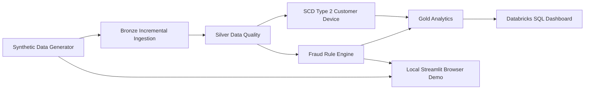

# UPI Sentinel Lakehouse


Synthetic Data only: every CSV and Delta output in this project is generated synthetic UPI-like telemetry for demos, interviews, and portfolio use. It is not real banking data.

## Business Problem

UPI payments are high-volume and time-sensitive, which makes fraud detection hard when signals arrive incrementally and customer behavior changes over time. This project demonstrates a lakehouse pipeline that:

- ingests synthetic UPI events incrementally
- quarantines bad records with data-quality rules
- tracks customer and device history with SCD Type 2
- detects mule-account and fraud patterns with PySpark rules
- publishes Gold tables for analytics and Databricks SQL dashboards

## Architecture

Architecture image: [`architecture/upi_lakehouse_architecture.png`](architecture/upi_lakehouse_architecture.png)

Mermaid diagram:



Text view:

```text
Synthetic Data Generator
        |
        v
Bronze Incremental Ingestion
        |
        v
Silver Data Quality + Quarantine
        |
        v
SCD Type 2 Customer / Device History
        |
        v
Fraud Rule Engine
        |
        v
Gold Analytics Tables
        |
        v
Databricks SQL Dashboard
```

## Folder Structure

```text
upi-sentinel-lakehouse/
|-- app.py                         # Local Streamlit browser demo
├── README.md
├── LICENSE
├── requirements.txt
├── architecture/
│   └── upi_lakehouse_architecture.png
├── data_generator/
│   └── generate_upi_transactions.py
├── notebooks/
│   ├── 01_bronze_incremental_ingestion.py
│   ├── 02_silver_data_quality.py
│   ├── 03_scd2_customer_device.py
│   ├── 04_fraud_rule_engine.py
│   └── 05_gold_risk_analytics.py
├── sql/
│   ├── fraud_kpi_queries.sql
│   └── dashboard_queries.sql
├── tests/
│   └── data_quality_tests.py
└── sample_data/
    └── upi_transactions_sample.csv
```

## Tech Stack

| Area | Stack |
|---|---|
| Language | Python, SQL |
| Processing | PySpark |
| Storage | Delta Lake |
| Modeling | Bronze-Silver-Gold, SCD Type 2, Delta MERGE |
| Ingestion | Incremental file streaming, Auto Loader style `cloudFiles` fallback |
| Quality | PyDeequ-style custom checks without external libraries |
| Analytics | Fraud rules, mule detection, merchant KPIs |
| Local demo UI | Streamlit, pandas |
| Runtime | Databricks Community Edition compatible |

## Pipeline Order

Run the project in this exact order:

1. Data generator
2. Bronze incremental ingestion
3. Silver data quality
4. SCD Type 2
5. Fraud rule engine
6. Gold analytics

## Setup

1. Install dependencies.
   ```bash
   pip install -r requirements.txt
   ```
2. Generate the synthetic source files.
   ```bash
   python data_generator/generate_upi_transactions.py --output-dir sample_data --transactions 10000 --customers 2000 --transactions-file upi_transactions.csv --customers-file customer_dim.csv
   ```
3. Run the Bronze step.
   ```bash
   python notebooks/01_bronze_incremental_ingestion.py
   ```
4. Run the Silver data-quality step.
   ```bash
   python notebooks/02_silver_data_quality.py
   ```
5. Run the SCD Type 2 step.
   ```bash
   python notebooks/03_scd2_customer_device.py
   ```
6. Run the fraud rule engine.
   ```bash
   python notebooks/04_fraud_rule_engine.py
   ```
7. Build Gold analytics.
   ```bash
   python notebooks/05_gold_risk_analytics.py
   ```
8. Execute tests.
   ```bash
   pytest -q
   ```

## Run the Local Browser Demo

The repository includes a Streamlit application for local browser exploration. It reads the checked-in 10,000-row Synthetic Data sample and provides dashboard views for transaction volume, fraud rules, data quality, high-risk users, and filtered transactions.

1. Create and activate a virtual environment.
   ```bash
   python -m venv .venv
   # Windows PowerShell
   .\\.venv\\Scripts\\Activate.ps1
   # macOS/Linux
   source .venv/bin/activate
   ```
2. Install the local demo dependencies.
   ```bash
   python -m pip install -r requirements.txt
   ```
3. Start the browser application.
   ```bash
   python -m streamlit run app.py
   ```
4. Open the URL printed by Streamlit, normally `http://localhost:8501`.

The local app is a pandas demonstration of the Spark fraud rules. It is intended for browser review and portfolio demonstrations; the notebooks remain the Databricks-compatible execution path for Bronze, Silver, SCD Type 2, fraud scoring, and Gold Delta tables.

### One-Click Startup

For a quick local review, double-click `START_UPI_SENTINEL.bat` from Windows Explorer. It creates the local virtual environment when needed, installs only the dashboard dependencies, selects a free port, opens the laptop browser, and prints a same-Wi-Fi mobile URL. The laptop and mobile device must be on the same network, and Windows Firewall may need to allow Python for mobile access.

The launcher does not use email authentication. A local browser URL is controlled by the laptop and network; an email address alone cannot deploy or expose a localhost application.

## Databricks Notes

- The notebooks are written in script form so they can be copied into Databricks notebooks or run as `.py` files in a Spark environment.
- The Bronze notebook prefers the generated `sample_data/upi_transactions.csv` file and falls back to the checked-in demo sample.
- The checked-in demo sample is `sample_data/upi_transactions_sample.csv` with 10,000 synthetic rows.
- The pipeline is designed to work with Delta paths such as `delta/bronze/...`, `delta/silver/...`, and `delta/gold/...`.
- All generated outputs remain Synthetic Data artifacts.

## Data-Quality Rules

The Silver step implements 12+ checks, including:

- `transaction_id` is not null
- `utr_number` is not null and unique
- `amount > 0`
- sender VPA format is valid
- receiver VPA format is valid
- timestamp is not in the future
- `user_id` is not null
- `status` is either `SUCCESS` or `FAILED`
- failure reason is present for failed transactions
- device ID is not null
- IP address has a valid IPv4 pattern
- merchant category and city are not null

Bad rows are quarantined to `silver.quarantine`.

## Fraud-Detection Rules

The Fraud Rule Engine computes `fraud_reason`, `risk_score`, and `is_fraud` using these rules:

- `velocity_check`: transaction amount in a 1-minute window exceeds 50,000
- `geo_anomaly`: same user appears in two cities within 5 minutes
- `device_mule_check`: same device is used by 3 different users in 10 minutes
- `failure_burst_check`: 5 failed attempts followed by a success

## Expected Gold Tables

The Gold step produces these tables:

- `gold.fraud_transactions`
- `gold.mule_accounts`
- `gold.daily_merchant_fraud_kpi`

Typical columns include:

- `gold.fraud_transactions`: `transaction_id`, `user_id`, `timestamp`, `amount`, `merchant_category`, `risk_score`, `fraud_reason`, `is_fraud`
- `gold.mule_accounts`: `user_id`, `flagged_transaction_count`, `distinct_devices`, `distinct_cities`, `max_risk_score`
- `gold.daily_merchant_fraud_kpi`: `transaction_date`, `merchant_category`, `fraud_transaction_count`, `fraud_amount`, `avg_risk_score`

## Sample SQL Results

These are illustrative examples of the kinds of results you can expect after running the pipeline on Synthetic Data.

### Top Risk Users

| user_id | fraud_txn_count | fraud_amount | max_risk_score |
|---|---:|---:|---:|
| USR00000001 | 12 | 84250.00 | 100 |
| USR00000007 | 9 | 61120.00 | 95 |

### Merchant Fraud KPI

| transaction_date | merchant_category | fraud_transaction_count | fraud_amount |
|---|---|---:|---:|
| 2026-08-19 | electronics | 18 | 145000.00 |
| 2026-08-19 | food_delivery | 11 | 27400.00 |

## Interview Explanation

If you are asked to explain the project in an interview, keep the story simple:

1. I built a synthetic UPI lakehouse to show how fraud can be detected incrementally rather than only in batch.
2. Bronze captures incoming transactions, Silver enforces quality rules, and quarantine keeps bad records out of analytics.
3. SCD Type 2 preserves customer and device history so behavior changes can be tracked over time.
4. The fraud engine assigns risk using transparent rules for velocity, geo anomalies, mule devices, and brute-force bursts.
5. Gold tables support dashboarding and investigative SQL queries for risk operations.

## Synthetic Data Disclaimer

All generated source files, Delta tables, and sample outputs are Synthetic Data only. Do not describe this repository as real banking telemetry or actual UPI customer data.
